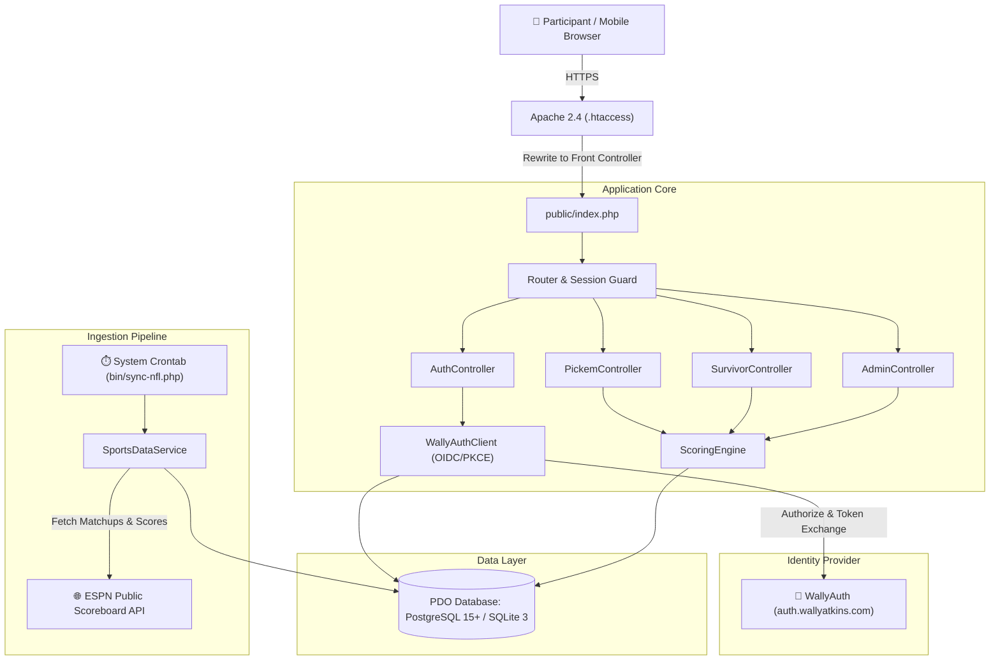
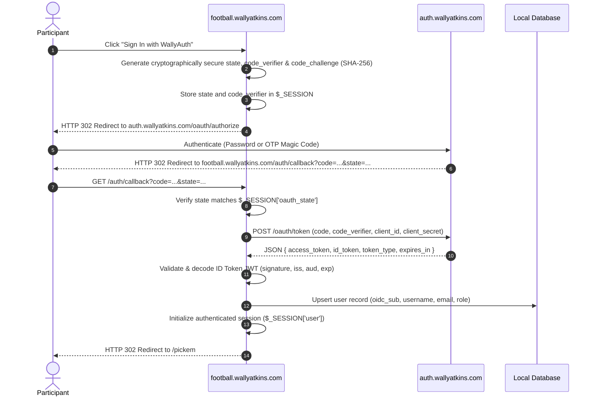
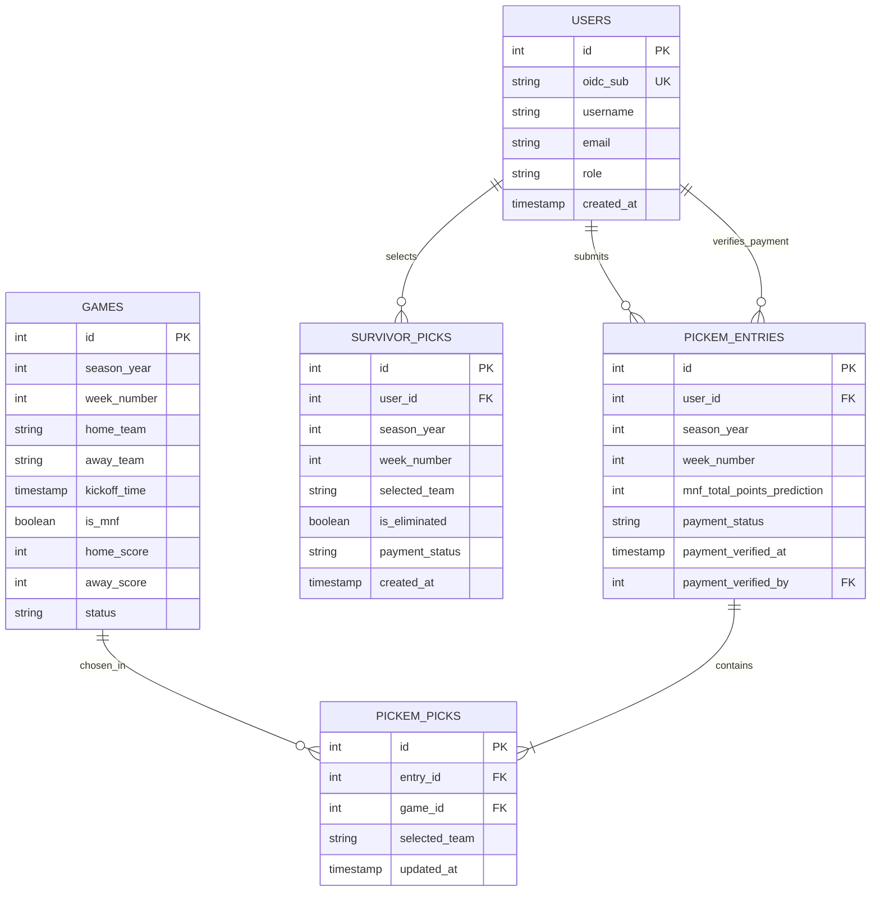
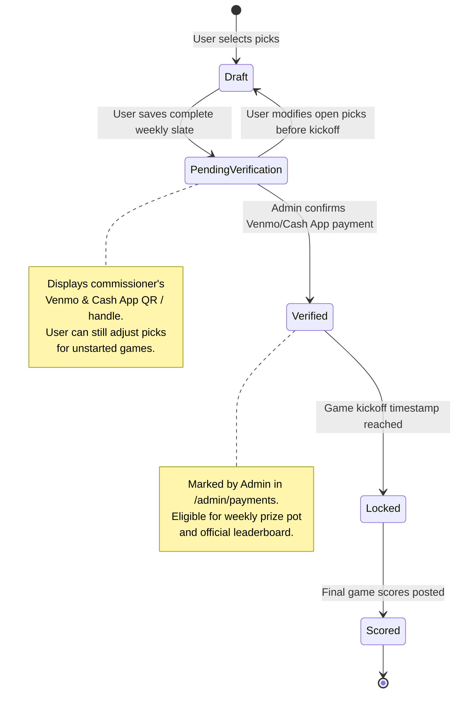

# Architecture Blueprint & Technical Specifications

| **System Blueprint** | **Technical Details** |
|:---|:---|
| **Application** | `football.wallyatkins.com` |
| **Architectural Pattern** | Lightweight Layered MVC / Server-Rendered Front Controller |
| **Runtime Environment** | PHP 8.2+ CLI / Apache 2.4 mod_php or FastCGI |
| **Database Engine** | Dual: PostgreSQL 15+ (Production) & SQLite 3 (Dev/Test) via PDO |
| **Authentication Authority** | WallyAuth (`https://auth.wallyatkins.com`) via OIDC / PKCE |
| **Hosting Platform** | Bluehost Linux Shared Hosting / Traefik Reverse Proxy Parity |

---

## 1. System Overview & Component Diagram

The application is structured into four decoupled layers:
1. **Presentation & Templates**: Server-rendered PHP templates utilizing Tailwind CSS utility classes and lightweight Alpine.js reactivity for pick submissions.
2. **Controllers & Routing**: Native HTTP Front Controller parsing URI requests, enforcing CSRF protection, and gating endpoints via session middleware.
3. **Domain Services**: Dedicated service components handling OIDC token validation, sports data ingestion, and pick scoring/standings calculation.
4. **Data Access Layer**: Resilient PDO connection wrapper abstracting syntax differences between PostgreSQL and SQLite.



---

## 2. Authentication & Identity Architecture (OIDC + PKCE)

All authentication is delegated to **WallyAuth**. The application implements an OAuth 2.0 / OpenID Connect Authorization Code Grant with Proof Key for Code Exchange (PKCE) utilizing the `S256` code challenge method.



### OIDC Configuration Specification
- **Authorization Endpoint**: `https://auth.wallyatkins.com/oauth/authorize`
- **Token Endpoint**: `https://auth.wallyatkins.com/oauth/token`
- **UserInfo Endpoint**: `https://auth.wallyatkins.com/oauth/userinfo`
- **JWKS URI**: `https://auth.wallyatkins.com/.well-known/jwks.json`
- **Scopes Requested**: `openid profile email roles`
- **Session Attributes**:
  - `user_id`: Local integer ID in `users` table.
  - `oidc_sub`: Subject identifier from WallyAuth.
  - `username`: Display name or preferred username.
  - `email`: User verified email address.
  - `role`: `player` or `admin`.

---

## 3. Relational Schema & Data Architecture

The schema is architected to run seamlessly on both **PostgreSQL 15+** (production shared hosting) and **SQLite 3** (local developer environment and unit tests) by standardizing data types and avoiding proprietary extensions.



### Complete DDL Script (Cross-Platform)

```sql
-- Users Table: Identity synced from WallyAuth
CREATE TABLE IF NOT EXISTS users (
    id SERIAL PRIMARY KEY,
    oidc_sub VARCHAR(255) UNIQUE NOT NULL,
    username VARCHAR(100) NOT NULL,
    email VARCHAR(255) NOT NULL,
    role VARCHAR(20) DEFAULT 'player',
    created_at TIMESTAMP WITH TIME ZONE DEFAULT CURRENT_TIMESTAMP
);
CREATE INDEX IF NOT EXISTS idx_users_sub ON users(oidc_sub);

-- NFL Games & Schedule Table
CREATE TABLE IF NOT EXISTS games (
    id SERIAL PRIMARY KEY,
    season_year INT NOT NULL,
    week_number INT NOT NULL,
    home_team VARCHAR(10) NOT NULL,
    away_team VARCHAR(10) NOT NULL,
    kickoff_time TIMESTAMP WITH TIME ZONE NOT NULL,
    is_mnf BOOLEAN DEFAULT FALSE,
    home_score INT DEFAULT NULL,
    away_score INT DEFAULT NULL,
    status VARCHAR(20) DEFAULT 'scheduled'
);
CREATE INDEX IF NOT EXISTS idx_games_season_week ON games(season_year, week_number);
CREATE INDEX IF NOT EXISTS idx_games_kickoff ON games(kickoff_time);

-- Weekly Pick'em Entries (One entry per user per week)
CREATE TABLE IF NOT EXISTS pickem_entries (
    id SERIAL PRIMARY KEY,
    user_id INT NOT NULL REFERENCES users(id) ON DELETE CASCADE,
    season_year INT NOT NULL,
    week_number INT NOT NULL,
    mnf_total_points_prediction INT DEFAULT NULL,
    payment_status VARCHAR(20) DEFAULT 'pending',
    payment_verified_at TIMESTAMP WITH TIME ZONE NULL,
    payment_verified_by INT NULL REFERENCES users(id) ON DELETE SET NULL,
    created_at TIMESTAMP WITH TIME ZONE DEFAULT CURRENT_TIMESTAMP,
    UNIQUE(user_id, season_year, week_number)
);
CREATE INDEX IF NOT EXISTS idx_pickem_entries_lookup ON pickem_entries(season_year, week_number, payment_status);

-- Individual Matchup Picks for Pick'em
CREATE TABLE IF NOT EXISTS pickem_picks (
    id SERIAL PRIMARY KEY,
    entry_id INT NOT NULL REFERENCES pickem_entries(id) ON DELETE CASCADE,
    game_id INT NOT NULL REFERENCES games(id) ON DELETE CASCADE,
    selected_team VARCHAR(10) NOT NULL,
    updated_at TIMESTAMP WITH TIME ZONE DEFAULT CURRENT_TIMESTAMP,
    UNIQUE(entry_id, game_id)
);
CREATE INDEX IF NOT EXISTS idx_pickem_picks_game ON pickem_picks(game_id);

-- Survivor Pool Weekly Selections
CREATE TABLE IF NOT EXISTS survivor_picks (
    id SERIAL PRIMARY KEY,
    user_id INT NOT NULL REFERENCES users(id) ON DELETE CASCADE,
    season_year INT NOT NULL,
    week_number INT NOT NULL,
    selected_team VARCHAR(10) NOT NULL,
    is_eliminated BOOLEAN DEFAULT FALSE,
    payment_status VARCHAR(20) DEFAULT 'pending',
    created_at TIMESTAMP WITH TIME ZONE DEFAULT CURRENT_TIMESTAMP,
    UNIQUE(user_id, season_year, week_number),
    UNIQUE(user_id, season_year, selected_team)
);
CREATE INDEX IF NOT EXISTS idx_survivor_user_season ON survivor_picks(user_id, season_year);
```

---

## 4. Payment Workflow State Machine

Because weekly pools operate among trusted friends without processor fees, payment transitions are managed via an administrative state machine:



---

## 5. Sports Data Ingestion Architecture

### Data Source & Protocol
- **Endpoint**: `https://site.api.espn.com/apis/site/v2/sports/football/nfl/scoreboard`
- **Query Parameters**: `?dates={YYYY}&seasontype=2&week={WW}` (where `seasontype=2` denotes regular season).
- **Execution Strategy**:
  1. **Daily (Off-Game Days)**: Runs at 04:00 UTC to sync schedule adjustments, venue shifts, or kickoff updates.
  2. **Active Game Days (Thursday, Sunday, Monday)**: Runs every 5 minutes during active game windows to ingest scores and final status.
- **Payload Extraction**:
  - `event.competitions[0].competitors`: Extracts home/away team abbreviations (e.g., `KC`, `BAL`), scores, and records.
  - `event.date`: ISO 8601 UTC kickoff timestamp.
  - `event.status.type.name`: Maps `STATUS_SCHEDULED` $\rightarrow$ `scheduled`, `STATUS_IN_PROGRESS` / `STATUS_HALFTIME` $\rightarrow$ `in_progress`, `STATUS_FINAL` $\rightarrow$ `final`.
  - **MNF Detection**: Evaluates kickoff day-of-week and time; games on Monday evening (UTC Tuesday 00:15–01:15) flag `is_mnf = TRUE`.

---

## 6. Project Directory Structure & Responsibilities

```plaintext
football.wallyatkins.com/
├── .bmad/                       # BMAD core configs and sprint manifests
│   ├── config.yaml              # Project metadata, stack definition, and epic list
│   └── manifests/
│       └── planning-manifest.yaml
├── docs/                        # Planning, architectural, and story artifacts
│   ├── prd.md                   # Core Product Requirements Document
│   ├── architecture.md          # This technical architecture blueprint
│   └── stories/                 # Sharded user stories for development
│       ├── story-1.1-scaffold-routing.md
│       ├── story-1.2-wallyauth-oidc-pkce.md
│       ├── story-2.1-db-schema-migrations.md
│       ├── story-2.2-sports-api-sync.md
│       ├── story-3.1-pickem-grid-lockout.md
│       ├── story-3.2-survivor-selection-engine.md
│       ├── story-4.1-admin-payment-verification.md
│       └── story-4.2-scoring-standings-rollover.md
├── public/                      # Apache web root
│   ├── index.php                # Front controller & request dispatcher
│   ├── assets/                  # Compiled styles, logos, and scripts
│   └── .htaccess                # Apache URL rewriting & security headers
├── src/
│   ├── Auth/
│   │   └── WallyAuthClient.php  # OIDC Authorization Code + PKCE client
│   ├── Controllers/
│   │   ├── AuthController.php   # Login, callback, logout handling
│   │   ├── PickemController.php # Pick submission, validation & lockout
│   │   ├── SurvivorController.php # Survivor team selection & exclusivity
│   │   └── AdminController.php  # Payment verification toggles & overrides
│   ├── Services/
│   │   ├── SportsDataService.php # ESPN API ingestion & schedule synchronizer
│   │   └── ScoringEngine.php    # Standings, tiebreaker delta, and rollover logic
│   └── Database/
│       └── Connection.php       # Resilient PDO wrapper (PostgreSQL/SQLite)
├── templates/                   # Server-rendered layouts (Tailwind design system)
│   ├── layout.php               # Master layout shell (nav, mobile bar, footer)
│   ├── auth/                    # Login prompt & error views
│   ├── pickem/                  # Pick'em weekly matchup grid & tiebreaker input
│   ├── survivor/                # Survivor team selection matrix & status badge
│   └── admin/                   # Payment toggle table & schedule refresh button
├── bin/
│   ├── sync-nfl.php             # CLI score & schedule synchronizer
│   └── migrate.php              # Automated schema migrator
├── tests/                       # Automated quality assurance suites
│   ├── Unit/
│   │   ├── ScoringEngineTest.php
│   │   └── LockoutTest.php
│   └── TestCase.php
├── composer.json                # Project dependencies and autoloader
├── phpunit.xml                  # PHPUnit test configuration
└── README.md                    # Operational guide and setup instructions
```

---

## 7. Deployment & Hosting Architecture (Bluehost / CI/CD)

1. **Subdomain Topology**:
   - URL: `https://football.wallyatkins.com`
   - Bluehost Document Root: `/home4/multili2/public_html/football`
   - Web Server: Apache 2.4 with `mod_rewrite` directing all requests to `public/index.php`.
2. **GitHub Actions CI/CD Pipeline**:
   - Standardized via `.github/workflows/deploy.yml` matching `wallyauth` and `WallyMud`.
   - CI triggers on push to `main`, executing PHP syntax linting and PHPUnit test suites.
   - Deploy step transfers assets to `/home4/multili2/public_html/football` via `SamKirkland/FTP-Deploy-Action@v4.3.5` using a dedicated sub-FTP account (`football@football.wallyatkins.com`), excluding local `.env` and SQLite test databases.
