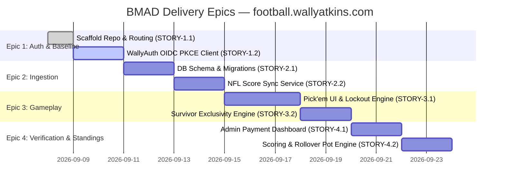

# Product Requirements Document (PRD)

| **Document Metadata** | **Details** |
|:---|:---|
| **Application** | `football.wallyatkins.com` |
| **Product Name** | Atkins NFL Pool (Pick'em & Survivor) |
| **Methodology** | BMAD (Breakthrough Method for Agile AI-Driven Development) |
| **Stage** | Agentic Planning — Core PRD Manifest |
| **Author** | Wally Atkins & AI Engineering Partner (Antigravity) |
| **Target Audience** | Private Friends & Family Group (10–20 active participants) |
| **Status** | Approved for Execution |

---

## 1. Executive Summary & System Intent

The primary objective of **`football.wallyatkins.com`** is to provide a modern, responsive, high-reliability web application dedicated to running private NFL weekly straight Pick'em and season-long Survivor pools. Designed for an intimate group of 10–20 trusted participants, the system emphasizes simplicity, transparent auditability, and zero transaction overhead. 

Rather than relying on third-party commercial platforms laden with advertisements, tracking scripts, and rigid payment gateways, this application integrates natively into the **wallyatkins.com** ecosystem. It offloads identity and single sign-on (SSO) to **WallyAuth** (`auth.wallyatkins.com`), automates game schedule and score ingestion from community sports data feeds, and implements an admin-verified manual payment state machine for weekly stakes (Venmo and Cash App) that avoids processing fees.

---

## 2. Personas & Stakeholders

1. **The Player (Participant)**:
   - Authenticates using their existing WallyAuth credentials.
   - Views the active weekly NFL slate with current team matchups, game dates, network broadcast indicators, and kickoff times.
   - Makes straight-up winner selections (no spread) for each game and inputs a tiebreaker score for the designated Monday Night Football game.
   - Selects a single team in Survivor mode, with clear visual cues indicating previously burned teams.
   - Tracks weekly entry payment instructions, submission verification status, live game scores, and personal standings.

2. **The Pool Commissioner (Administrator)**:
   - Possesses the `admin` role claim issued by WallyAuth or configured in system overrides.
   - Verifies participant entry fee payments via a quick-action dashboard with a single click.
   - Triggers manual or automated schedule/score refreshes.
   - Manages weekly pot allocations, tiebreak evaluations, and carryover rollovers.
   - Exercises override authority in cases of rescheduled games, cancellations, or emergency pick adjustments prior to kickoff.

---

## 3. Scope & Ecosystem Boundaries

### In-Scope
- **Pick'em Mode**: Weekly straight-up pick submissions across all regular season NFL games (Weeks 1–18).
- **Survivor Mode**: Single-pick weekly survival challenge with season-long team exclusivity and elimination logic.
- **WallyAuth OIDC Integration**: Complete Authorization Code flow with PKCE, session persistence, and role claim evaluation.
- **Automated Score & Schedule Ingestion**: Resilient data pipeline fetching NFL matchups, game clock states, and final scores.
- **Manual Payment State Machine**: Explicit progression (`draft` $\rightarrow$ `pending_verification` $\rightarrow$ `paid` / `locked`) with Venmo/Cash App directions.
- **Scoring & Standings**: Dynamic calculation of weekly winners, point differentials, season totals, and carryover pots.
- **Responsive Theme**: Strict design continuity with `wallyatkins.com` design tokens, dark/light contrast, and mobile ergonomics.

### Out-of-Scope (Non-Goals)
- Point spread or over/under betting mechanics (straight-up moneyline winner selection only).
- Direct credit card processing or in-app payment gateway integrations (Stripe, PayPal SDKs are excluded to avoid fees and compliance burdens).
- Public registration or open community pools (restricted to pre-approved WallyAuth identity realm).
- Fantasy football player-level tracking or statistics (limited strictly to team game outcomes).

---

## 4. Functional Requirements (FR)

### FR-01: Authentication & Session Management
- **FR-01.1**: The application shall initiate authentication exclusively via WallyAuth (`https://auth.wallyatkins.com/oauth/authorize`) utilizing the standard OpenID Connect (OIDC) Authorization Code Flow with PKCE (`S256`).
- **FR-01.2**: Upon callback exchange (`POST /oauth/token`), the application shall validate the ID Token signature and extract claims: `sub`, `email`, `preferred_username`, and `roles`.
- **FR-01.3**: The user record in the local `users` table shall be upserted on each login. If the user possesses the `admin` role or matches designated administrator identifiers, their local role shall be set to `admin`.
- **FR-01.4**: User sessions shall be maintained via secure, HTTP-only, SameSite cookies with a 14-day inactivity expiration.

### FR-02: Game Slate & Data Ingestion
- **FR-02.1**: The system shall periodically ingest official NFL season schedule and live game data via automated CLI/Cron commands (`bin/sync-nfl.php`).
- **FR-02.2**: The primary data provider shall be the free ESPN hidden public scoreboard API (`https://site.api.espn.com/apis/site/v2/sports/football/nfl/scoreboard`), with structural fallback to community feeds (MySportsFeeds / SportsDataIO).
- **FR-02.3**: Ingested game records must capture: `season_year`, `week_number`, `home_team` (abbreviation & name), `away_team`, `kickoff_time` (UTC timestamp), `is_mnf` boolean flag, `home_score`, `away_score`, and status (`scheduled`, `in_progress`, `final`).
- **FR-02.4**: Games flagged as Monday Night Football (`is_mnf = TRUE`) shall be designated as the weekly tiebreaker game. If multiple MNF games occur in a single week (doubleheaders), the game with the latest kickoff timestamp shall serve as the tiebreaker.

### FR-03: Pick'em Game Mode
- **FR-03.1**: Participants shall submit straight-up predictions (home or away winner) for every scheduled matchup in the active NFL week.
- **FR-03.2 (Game Kickoff Lockout)**: Each individual matchup shall lock exactly at its recorded `kickoff_time`. Once the current UTC timestamp is greater than or equal to `kickoff_time`, the system must reject updates to that specific game pick while allowing edits to future games in that week's slate.
- **FR-03.3 (Tiebreaker Score Prediction)**: Entrants must submit a predicted combined total point score (e.g., `48`) for the designated tiebreaker game prior to that game's kickoff.
- **FR-03.4 (Pick Visibility)**: To ensure fair play, participants may view their own picks at any time, but opposing participants' picks for a game remain obscured until that specific game has kicked off.

### FR-04: Survivor Game Mode
- **FR-04.1**: Participants shall select exactly one winning team per active NFL week.
- **FR-04.2 (Team Exclusivity)**: A participant cannot select any NFL team that they have already chosen in a prior week of the current season (`UNIQUE(user_id, season_year, selected_team)`).
- **FR-04.3 (Elimination Rules)**:
  - If the participant's chosen team loses or ends in a tie, the entry is marked `is_eliminated = TRUE`.
  - Failure to submit a pick before the week's first kickoff (or prior to the chosen game's kickoff) results in automatic elimination.
- **FR-04.4 (Last Player Standing)**: The Survivor pool concludes when only one active (non-eliminated) participant remains, or when all remaining participants are eliminated in the same week (triggering a split or rollover).

### FR-05: Manual Payment Workflow & Admin Dashboard
- **FR-05.1 (State Machine)**: Every weekly entry adheres to a strict four-state workflow:
  $$\text{draft} \longrightarrow \text{pending\_verification} \longrightarrow \text{paid (verified)} \longrightarrow \text{locked}$$
- **FR-05.2 (Participant Payment Prompt)**: Upon saving a weekly pick slate, entrants are presented with payment instructions detailing the weekly entry stake (e.g., $10/week for Pick'em, $25 season for Survivor), alongside direct links and QR handles for the commissioner's Cash App and Venmo accounts.
- **FR-05.3 (Verification Portal)**: Administrators accessing `/admin/payments` shall have a real-time table of all entrants for the active week, showing user name, submission timestamp, pick completeness, and a single-click toggle button to mark entries as `paid` or `exempt`.
- **FR-05.4 (Audit Log)**: When an entry is verified, the system records `payment_verified_at = CURRENT_TIMESTAMP` and `payment_verified_by = admin_user_id`.
- **FR-05.5 (Standings Gate)**: Only entries with `payment_status = 'paid'` or `'exempt'` are eligible for weekly prize calculations or displayed in the official leaderboard. Unverified entries are marked with a visual pending badge and excluded from prize eligibility.

### FR-06: Scoring & Carryover Engine
- **FR-06.1 (Pick'em Score)**: Each correct straight pick awards 1 point. Total weekly score = count of correct picks.
- **FR-06.2 (Tie Resolution Order)**:
  1. **Primary**: Total correct picks.
  2. **Secondary (Tiebreaker)**: Absolute difference between the entrant's predicted total MNF points and the actual combined final score:
     $$\Delta = |\text{Predicted Points} - \text{Actual Points}|$$
     The participant with the smallest delta wins.
  3. **Tertiary (Remaining Ties)**: If deltas are identical, the weekly pot is split equally among tied winners, or carried over to the subsequent week depending on the season configuration (`pot_resolution = 'split' | 'rollover'`).
- **FR-06.3 (Pot Calculation)**: Total Weekly Pot = $\sum (\text{Verified Paid Entries} \times \text{Entry Fee})$.

---

## 5. Non-Functional Requirements (NFR)

- **NFR-01 (Runtime & Web Engine)**: Clean PHP 8.2+ architecture running under Apache 2.4 with `mod_rewrite` enabled. Routing directed through a front controller (`public/index.php`) with zero dependency on heavyweight full-stack frameworks.
- **NFR-02 (Data Layer & Portability)**: Standard PDO implementation compatible with both PostgreSQL 15+ (production Bluehost database) and SQLite 3 (local development and automated testing in WAL mode). All queries strictly parameterized with zero raw string concatenation.
- **NFR-03 (Frontend Aesthetics & Design System)**: Consistent UI styling matching `wallyatkins.com`, leveraging Tailwind CSS utilities, deep charcoal backgrounds (`#0f172a` / `#1e293b`), amber/emerald accents for success and picks, and high-contrast typography optimized for mobile devices.
- **NFR-04 (Deployment & Reverse Proxy)**: Clean execution behind Apache VirtualHosts or Traefik reverse proxies terminating SSL at `https://football.wallyatkins.com`. Proper handling of `X-Forwarded-Proto`, `X-Forwarded-Host`, and HTTPS redirects.

---

## 6. BMAD Epics & Delivery Milestones

